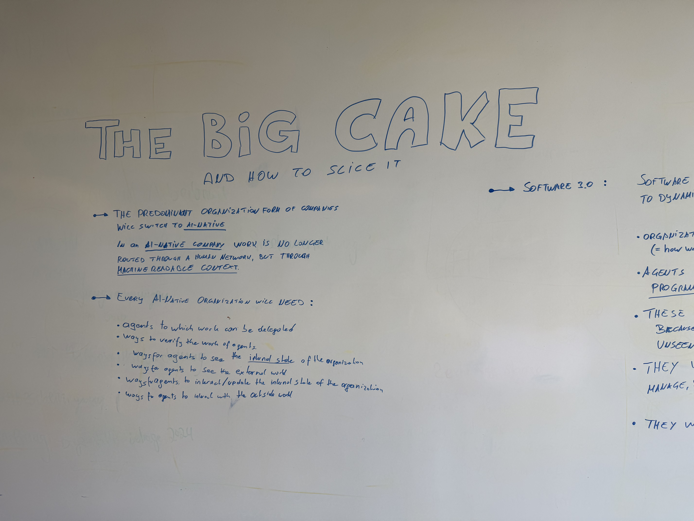
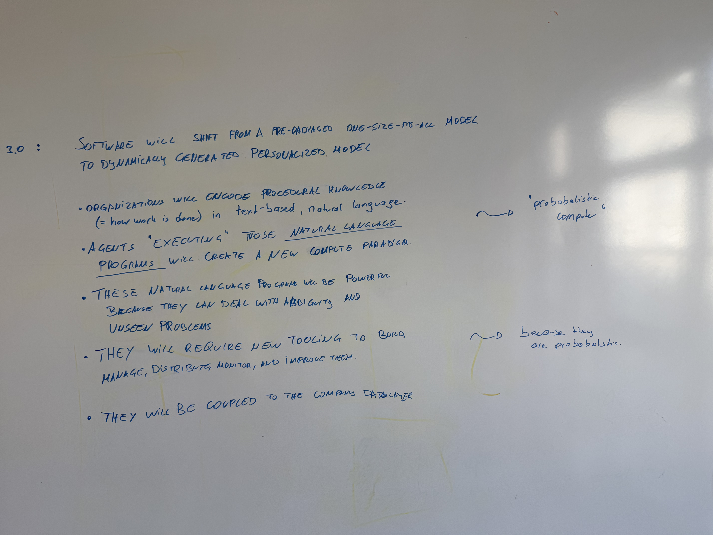
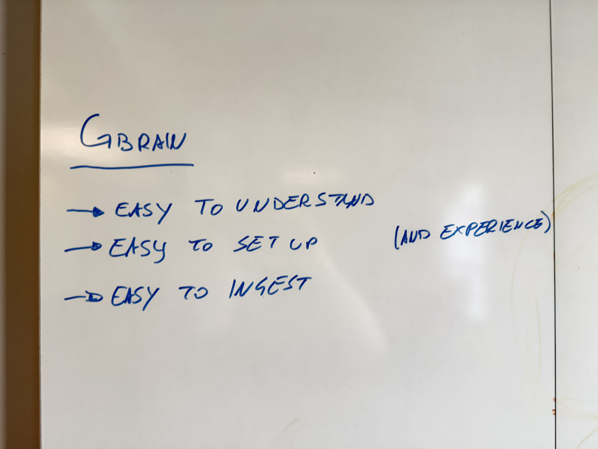

# The Big Cake — and how to slice it

Status: Working note — whiteboard session
Author: Micha
Date: 2026-07-04 (photos imported from whiteboard)
Related: [the-agentic-future.md](the-agentic-future.md) — the full assumption stack behind this

Three whiteboard panels. Photos in `assets/notes/`, transcribed below.
Note: panel 1 and panel 2 overlap — the Software 3.0 column starts at the
right edge of the first photo and is fully captured in the second.

## 1. AI-native companies

Transcription:

> **THE BIG CAKE — and how to slice it**
>
> → The predominant organization form of companies will switch to **AI-native**.
>
> In an AI-native company work is no longer routed through a human network,
> but through **machine-readable context**.
>
> → Every AI-native organization will need:
> - agents to which work can be delegated
> - ways to verify the work of agents
> - ways for agents to see the **internal state** of the organization
> - ways for agents to see the external world
> - ways for agents to interact / update the internal state of the organization
> - ways for agents to interact with the outside world

## 2. Software 3.0 / skills

Transcription:

> **Software 3.0:** Software will shift from a pre-packaged one-size-fits-all
> model to a dynamically generated, personalized model.
>
> - Organizations will encode procedural knowledge (= how work is done) in
>   text-based, natural language. ~→ *"probabilistic compute"*
> - Agents "executing" those **natural language programs** will create a new
>   compute paradigm.
> - These natural language programs will be powerful because they can deal
>   with ambiguity and unseen problems.
> - They will require new tooling to build, manage, distribute, monitor, and
>   improve them. ~→ *because they are probabilistic*
> - They will be coupled to the company data layer.

## 3. Making company-brain adoption possible (GBrain)

Transcription:

> **GBRAIN**
> → easy to understand (and experience)
> → easy to set up
> → easy to ingest
